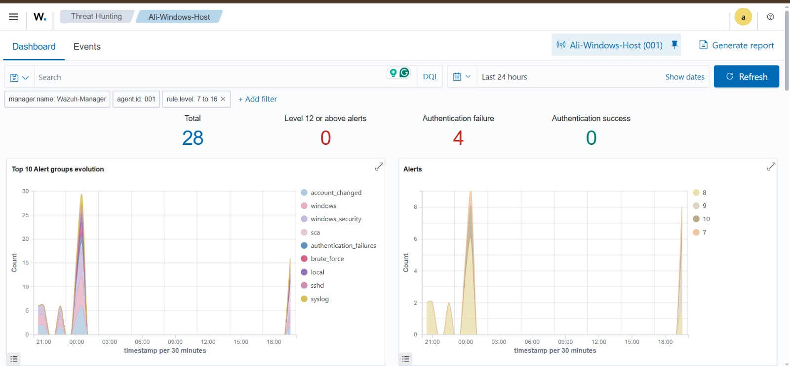
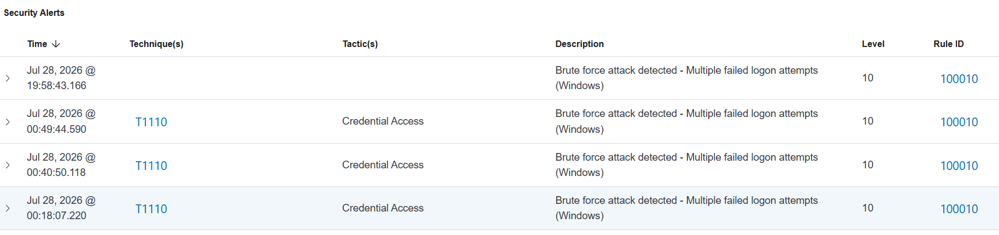
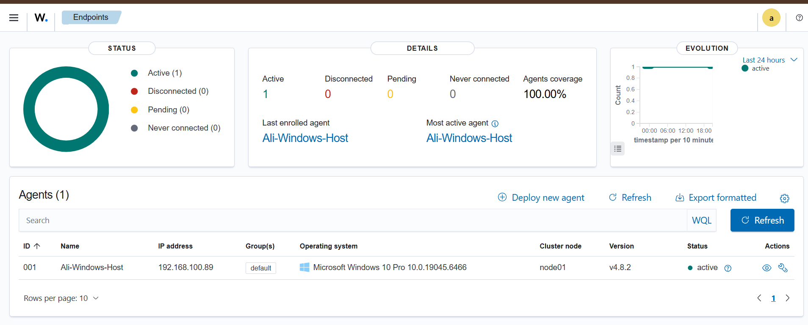
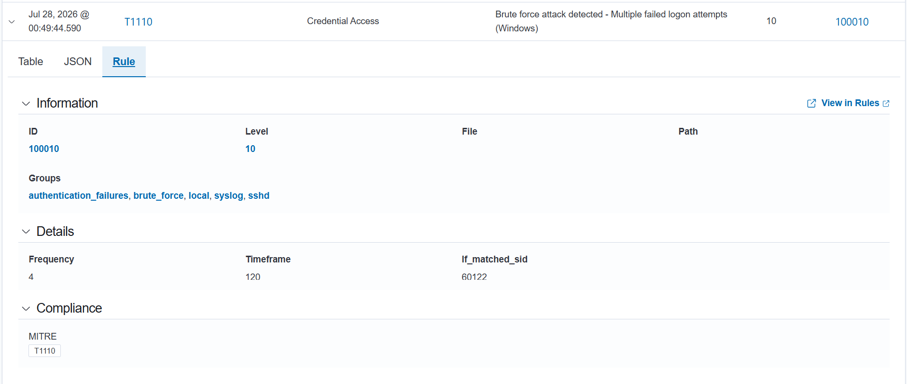

# Wazuh SIEM/XDR Home SOC Lab

A self-hosted Security Operations Center (SOC) lab built using Wazuh, designed to monitor endpoint activity, detect authentication threats, and generate custom correlation alerts — including a hand-written brute-force detection rule.

## Overview

This project simulates a real-world SIEM deployment in a home lab environment. It covers the full lifecycle of a security monitoring pipeline: from infrastructure setup, to agent deployment, to writing and testing a custom detection rule that flags brute-force login attempts in real time.

## Architecture

Host: Windows 11 laptop running the Wazuh Agent
Guest: Ubuntu 24.04 LTS VM (VirtualBox) running the full Wazuh all-in-one stack (Indexer, Manager, Filebeat, Dashboard)
Networking: Bridged adapter configuration so agent and manager communicate over the local network

## What's Included

- Full Wazuh stack deployment — Indexer, Manager, Filebeat, and Dashboard installed and configured on Ubuntu
- Windows endpoint integration — Wazuh Agent deployed on a Windows host, streaming real-time Security and Application event logs to the Manager
- File Integrity Monitoring (FIM) — tracking file and registry changes on the monitored endpoint
- Security Configuration Assessment (SCA) — automated benchmarking against CIS Microsoft Windows 10 standards
- Custom correlation rule — a hand-written Wazuh rule that detects brute-force login attempts by correlating multiple failed logon events (Windows Event ID 4625) within a defined time window
- MITRE ATT&CK mapping — alerts automatically tagged with relevant techniques (e.g., T1110 – Brute Force, T1078 – Valid Accounts)
- Compliance mapping — alerts cross-referenced against GDPR, HIPAA, PCI DSS, NIST 800-53, and GPG13 frameworks out of the box

## Custom Detection Rule: Brute-Force Correlation

Wazuh's default ruleset detects individual failed login attempts (Rule ID 60122) but does not correlate them into a single high-severity alert. To close this gap, I wrote a custom local rule:

    <rule id="100010" level="10" frequency="4" timeframe="120">
      <if_matched_sid>60122</if_matched_sid>
      <description>Brute force attack detected - Multiple failed logon attempts (Windows)</description>
      <group>authentication_failures,brute_force,</group>
      <mitre>
        <id>T1110</id>
      </mitre>
    </rule>

How it works:
- Monitors for repeated triggers of Rule 60122 (Windows logon failure)
- If 4 or more failures occur within a 120-second window, it fires a new, higher-severity alert (Level 10)
- Automatically tags the alert with MITRE ATT&CK technique T1110 (Brute Force) under the Credential Access tactic

Result: instead of seeing four separate low-priority failure logs, the SOC dashboard now surfaces a single, correctly prioritized "Brute force attack detected" alert — closer to how a real detection engineering workflow operates.
## Screenshots

### Dashboard Overview

### Custom Brute-Force Rule Triggering

### Endpoint Overview

### Rule Configuration Details

(Add your dashboard screenshots here — Overview page, Endpoints page, Security Alerts table, and the custom rule triggering in the dashboard.)

## Tech Stack

- Wazuh 4.8.2 (Indexer, Manager, Dashboard, Filebeat)
- Ubuntu 24.04 LTS (VirtualBox VM)
- Windows 11 (monitored endpoint)
- XML (custom rule authoring)
- MITRE ATT&CK Framework

## Key Learnings

- End-to-end SIEM deployment, including troubleshooting real infrastructure issues (resource-constrained CPU lockups during indexer installation, dynamic IP changes across networks, agent-manager connectivity)
- Practical understanding of log ingestion, event correlation, and alert tuning
- Hands-on rule-writing in Wazuh's XML-based rule engine, including frequency/timeframe correlation logic
- Mapping detections to industry frameworks (MITRE ATT&CK, compliance standards) the way a SOC analyst would in a production environment

## Author

Ali Imtiaz
Cybersecurity student | SOC Analyst path | Currently interning at National Bank of Pakistan, Information Security Division, Risk Management Group

This is a personal home lab project built for learning purposes and is not affiliated with any employer.
